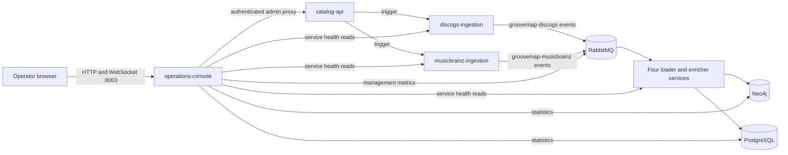
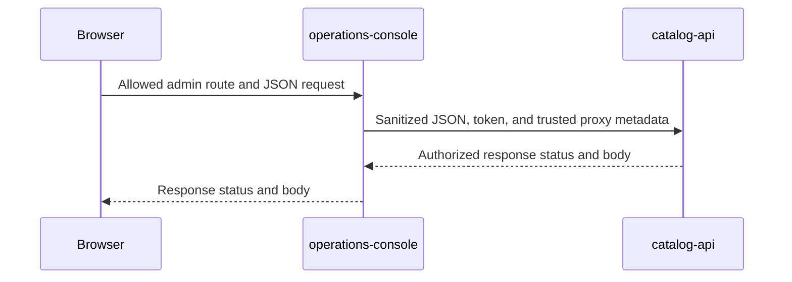

# Operations-console architecture

The operations console is the human-facing observability and privileged-administration surface for GrooveMap. It reads service, queue, Neo4j, and PostgreSQL health, presents live and historical metrics, and proxies authenticated operator requests to `catalog-api`. It does not own authentication, extraction, message consumption, or datastore schema.

## Repository boundary

`catalog-api` owns login, authorization, audit persistence, and privileged endpoints.
`discogs-ingestion` owns the Discogs producer and the `groovemap-discogs` catalog-event
contract; `musicbrainz-ingestion` independently owns the MusicBrainz producer and the
`groovemap-musicbrainz` contract. There is no combined ingestion producer. The four loader
and enricher repositories own their runtime consumers. `database-schema` owns datastore
compatibility, and `deployment` owns endpoints, credentials, and runtime composition.

This repository consumes promoted, immutable copies of the catalog API, catalog-event, and persistence contracts under `contracts/`. Each source record identifies the producer commit and content hashes. Contract validation fails when a promoted document and generated binding diverge.

| Promoted authority | Producer revision | Local artifact |
| --- | --- | --- |
| `catalog-api` operations-console routes | `bc684e90f5b834d3ffba6a5b244ce7d075c08292` | [`contracts/catalog-api/operations-console/v1/routes.json`](../contracts/catalog-api/operations-console/v1/routes.json) |
| `discogs-ingestion` catalog events | `c1bf1b4ada3ee88e1e6768a0be7fa6ed1b921831` | [`contracts/catalog-events/v1/discogs/contract.json`](../contracts/catalog-events/v1/discogs/contract.json) |
| `musicbrainz-ingestion` catalog events | `f0dae1037c809c6855863aebc35d0a7d21366482` | [`contracts/catalog-events/v1/musicbrainz/contract.json`](../contracts/catalog-events/v1/musicbrainz/contract.json) |
| `database-schema` persistence compatibility | `91cbf6e3712a2fa403693b5c81fde729f29cb4ce` | [`contracts/persistence/v1/compatibility.json`](../contracts/persistence/v1/compatibility.json) |

Brand assets are separately promoted from `groovemap-music/design` revision
`59c9fd3c8bbdfa676e0b7bb3d463fc766c1f3c0d`; [`source.json`](../dashboard/static/brand/source.json)
records the revision and the digest of every generated asset. `scripts/promote-brand.sh` is
the only supported promotion path.

## Browser and API surfaces

The public monitoring page receives live metrics over WebSocket and exposes read-only health endpoints. The administrator page sends bearer-authenticated requests through a constrained proxy whose allowed paths come from the promoted `catalog-api` contract. Queue names are derived from the promoted exchange prefixes; arbitrary queue and URL input is rejected.

## Runtime lifecycle

Startup initializes RabbitMQ, Neo4j, PostgreSQL, and the console's two-second live metrics loop. The historical queue and service-health collector runs in `catalog-api`; the console reaches its authenticated history routes through the admin proxy. A partial dependency failure is reported in health data instead of being presented as healthy. Shutdown snapshots connected WebSockets before awaiting close operations, cancels the live collector, and closes each client without holding the connection-set lock across network I/O.

The image is `operations-console`, runs as numeric user `1000:1000`, and embeds its exact forty-character source revision in OCI metadata and the browser-visible corresponding-source link.
